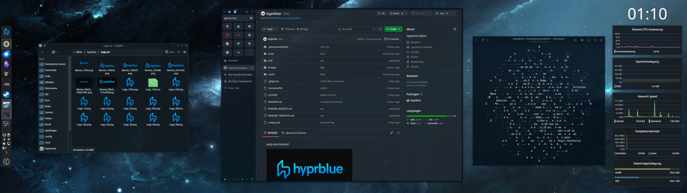
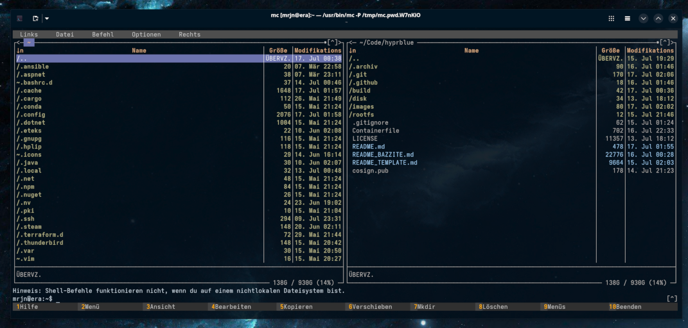
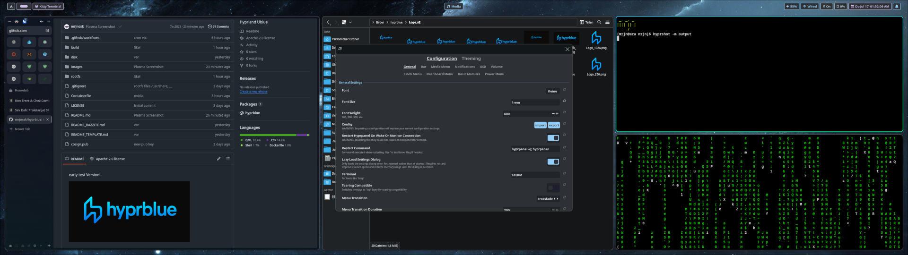

early test Version!


## Base

- Template: https://github.com/ublue-os/image-template
- Base: https://github.com/ublue-os/bazzite

## Bazzite

- KDE Plasma
- Steam
- Lutris
- Boxbuddy



## Additions

- kitty
- nvim
- mc



### Hyprland WM

- hyprpanel / waybar
- hypridle
- hyprlock
- hyprshot
- wofi
- matugen
- swww



### Personalisations

- Logos
- Wallpapers


### Instalation

At the Moment just from Existing Ublue Installation

```bash
rpm-ostree rebase ostree-unverified-registry:ghcr.io/mrjncsk/hyprblue
```
